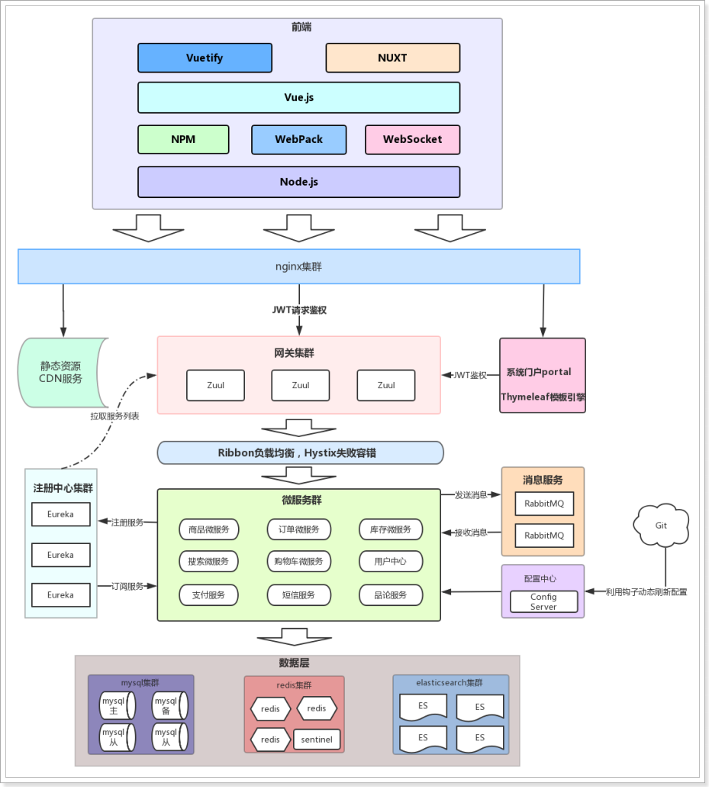

### 技术特点

- 技术范围广
- 技术新
- 高并发（分布式、静态化技术、缓存技术、异步并发、池化、队列）
- 高可用（集群、负载均衡、限流、降级、熔断）
- 数据量大 
- 业务复杂
- 数据安全

## 项目开发流程

项目经理：管人 

技术经理：

产品经理：设计需求原型 

测试：

前端：大前端：UI 前端页面。

后端：

移动端：

项目开发流程图：

 

## 项目介绍

- 用户可以在线购买商品、加入购物车、下单
- 可以评论已购买商品
- 管理员可以在后台管理商品的上下架、促销活动
- 管理员可以监控商品销售状况
- 客服可以在后台处理退款操作
- 希望未来3到5年可以支持千万用户的使用

## 系统架构

### 架构图

